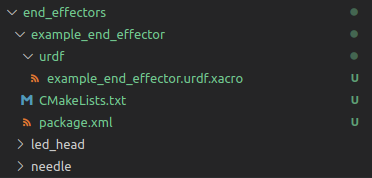

# Custom end effectors for HELENE

## Usage

The helene robot supports the use of custom end effectors. These end effectors can be used by adding the argument "end_effector:=END_EFFECTOR_NAME", when launching the robot.

Here are two examples:
```
roslaunch applications_helene simulation.launch end_effector:=led_head
roslaunch applications_helene realrobot.launch end_effector:=needle
```

## Creating/adding custom end effectors

You can create or add new custom end effectors to the robot. This is done by adding a new ROS package containing the urdf description.

### Package structure
The package should have the following structure:
The name of the package should be the same name as your end effector.
For a clear project structure it is preferable to locate the package inside the /end_effectors folder, although this is not mandatory.
The package must contain a folder called urdf.
Inside this folder the description of your end effector must be stored in a file called: "END_EFFECTOR_NAME.urdf.xacro".

<a href="url"></a>

If you want to use a package that does not have the same name as your end effector, you have to specify its name by adding the argument "end_effector_package:=END_EFFECTOR_PACKAGE", when launching the robot.
```
roslaunch applications_helene simulation.launch end_effector:=led_head end_effector_package:=example_package
```

### End effector description

To attach your end effector to the robot, your urdf.xacro file must include a static joint connecting your end effector with the last link of the helene robot arm (axis_0).
When defining this link, make sure that your geometry does not interfere with the geometry of the arm, as this can lead to problems with moveit path planning (0.1mm of clearance is usually sufficient).
You should also be aware that the current moveit configuration only works with static end effectors. If you want to use a dynamic end effector like a gripper, you will have to create and integrate a new moveit configuration.
