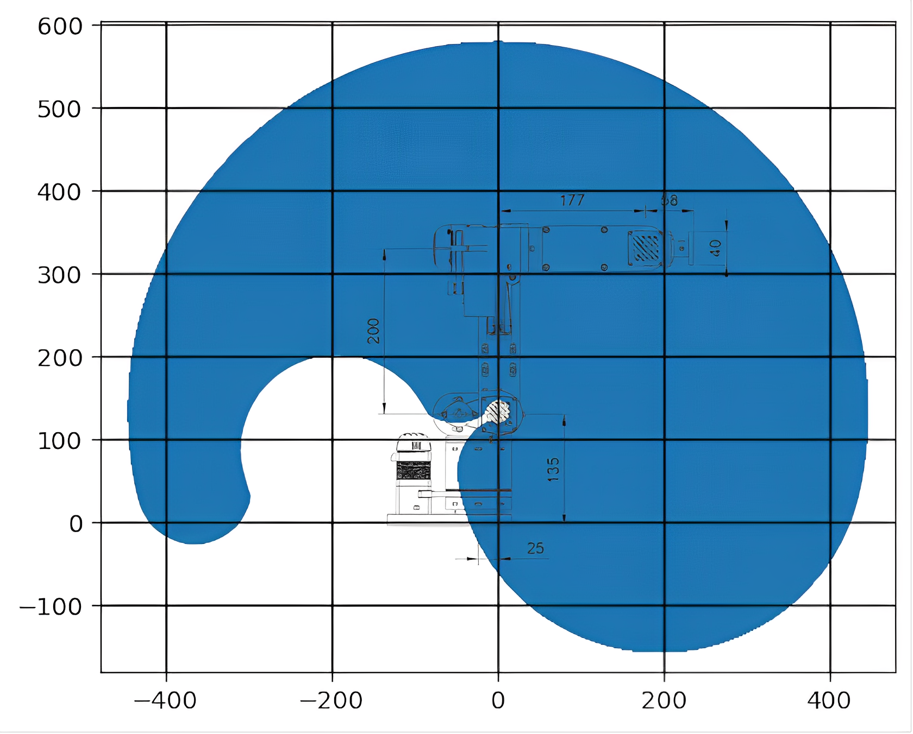
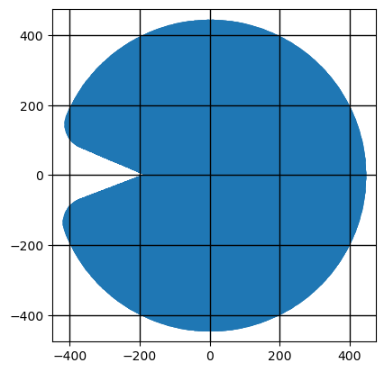
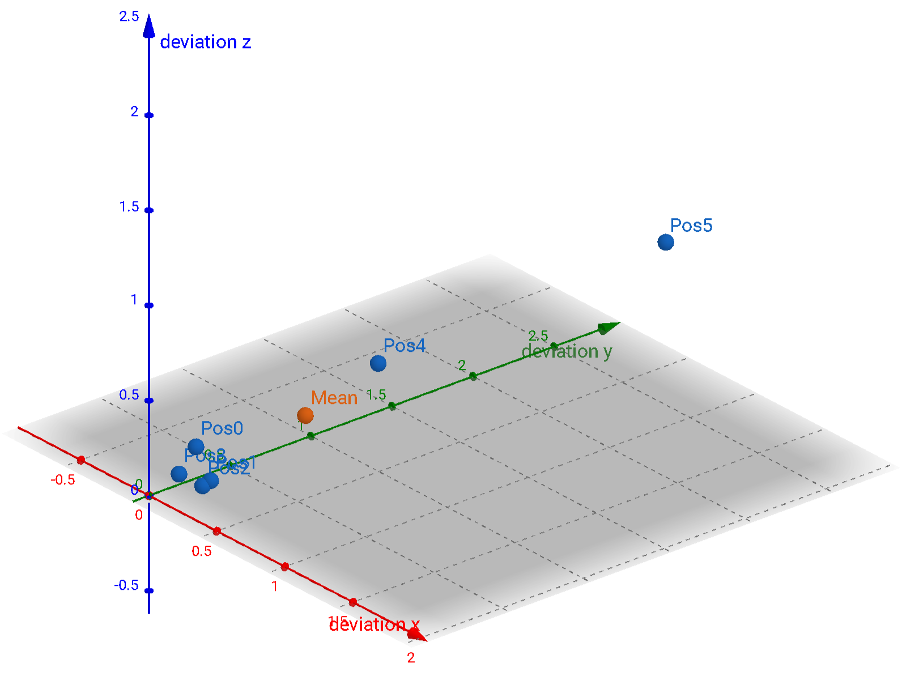
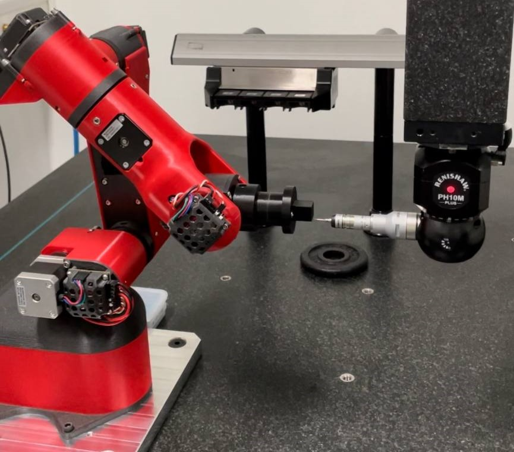

# Specifications

## Workspace

 

The workspace in the yz- and xy-planes. 

Joint limits:

| (degrees) | 1     | 2     | 3   | 4     | 5     | 6     |
| --------- | ----- | ----- | --- | ----- | ----- | ----- |
|           | \-160 | \-105 | 0   | \-166 | \-155 | \-180 |
|           | 160   | 105   | 160 | 166   | 155   | 180   |

## Accuracy and Precision

Accuracy and precision measurements are carried out according to ISO 9283, with small adjustments to the points. 

The following points in Helene coordinates (mm) are used:

| (mm) | home | 1      | 2      | 3     | 4     | 5     |
| ---- | ---- | ------ | ------ | ----- | ----- | ----- |
| x    | 247  |  326.2 |   36.3 | 181.5 | 326.7 |  36.3 |
| y    |   0  | -145.2 | -145.2 |   0   | 145.2 | 145.2 |
| z    | 345  |  76.3  |  366.7 | 221.5 | 76.3  | 366.7 |

### Repeatability

| (mm)  | home  | 1     | 2     | 3     | 4     | 5     | average |
| ----- | ----- | ----- | ----- | ----- | ----- | ----- | ------- |
| x     | 0.14  | 0.269 | 0.256 | 0.089 | 0.688 | 0.754 |         |
| y     | 0.173 | 0.155 | 0.116 | 0.111 | 0.837 | 2.556 |         |
| z     | 0.255 | 0.131 | 0.111 | 0.112 | 0.69  | 0.813 |         |
| total | 0.338 | 0.337 | 0.302 | 0.181 | 1.285 | 2.786 |  **0.872** |

### Positional Accuracy

The positional accuracy is evaluated at the same positions as repeatability. The home position of Helene is assumed to be true, and positions are evaluated relative to it.

| (mm)  | 1      | 2      | 3      | 4      | 5      | average |
| ----- | ------ | ------ | ------ | ------ | ------ | ------- |
| x     | -1.615 |  5.228 |  0.204 | -8.302 |  6.085 |         |
| y     |  9.178 | -3.643 | -4.362 | -0.038 | 10.397 |         |
| z     | -2.919 |  2.646 | -2.133 |  0.776 | -1.148 |         |
| total |  9.765 |  6.900 |  4.860 |  8.338 | 12.101 |  **8.393** |

Thank you to WENZEL Group for allowing us to use their coordinate measuring machines and assisting in the evaluation of the robot. 

